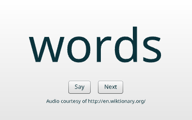

# Learn Words

A simple Flash app I wrote to help my daughter learn to read when she was
young. See it in action: [Just for you, Madeline][post] — possible thanks to
the [Ruffle] emulator.

To hear a word pronounced, click the **Say** button (or press <kbd>S</kbd>
or <kbd>Space</kbd>).

To go to the next word, click the **Next** button (or press <kbd>N</kbd> or
<kbd>Enter</kbd>).

## Audio Files

The audio files in [`words`](words/) are derivative works of pronunciations
from [Wiktionary]. They are dual-licensed under the [Creative Commons
Attribution-ShareAlike 4.0 International License][cc] and the [GNU Free
Documentation License][fdl].

## License

This project is released under the MIT License. See the [LICENSE](LICENSE)
file for details.

[cc]: https://creativecommons.org/licenses/by-sa/4.0/
[fdl]: https://www.gnu.org/licenses/fdl-1.3.html
[post]: https://blog.gbacon.com/posts/just-for-you-madeline
[Ruffle]: https://ruffle.rs/
[Wiktionary]: https://en.wiktionary.org/
